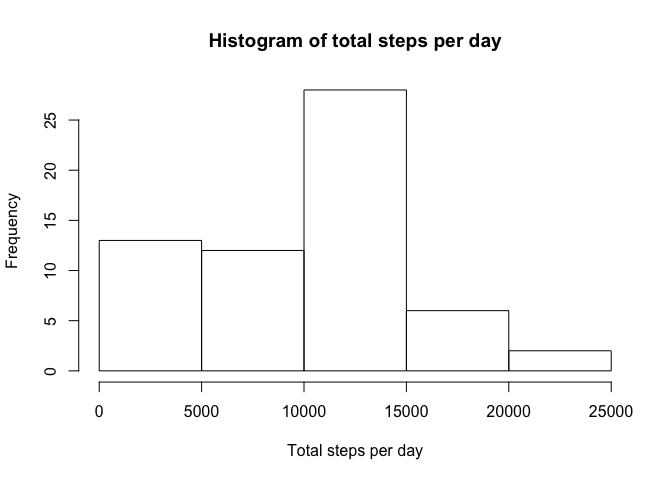
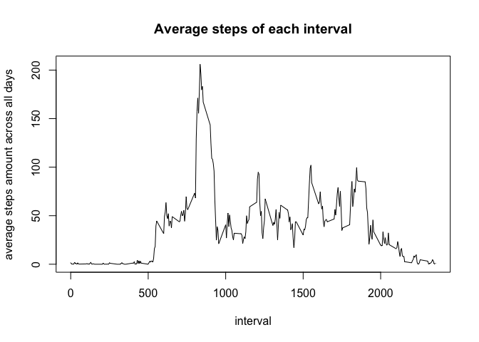
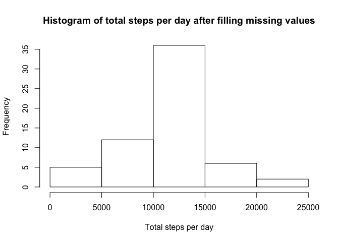
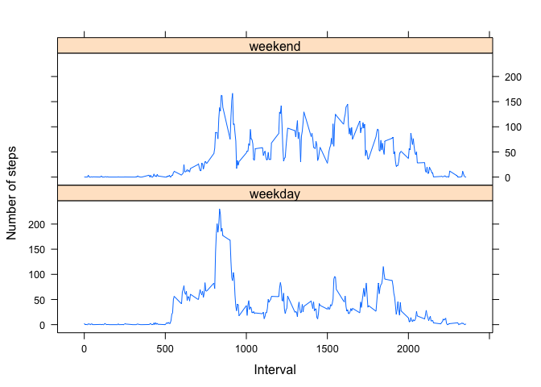

# Reproducible Research: Peer Assessment 1


## Loading and preprocessing the data


```r
unzip("activity.zip")
ActivityData <- read.csv("activity.csv")
ActivityData$date <- as.Date(ActivityData$date)
```


## What is mean total number of steps taken per day?
Calculate the total number of steps taken per day

```r
library(dplyr)
days <- group_by(ActivityData, date)
dailydata <- summarise(days, total_steps = sum(steps, na.rm = TRUE))
```

The histogram is as below, and we could find that most of the daily total steps are between 10000 and 15000:

```r
hist(dailydata$total_steps,xlab = "Total steps per day", main = "Histogram of total steps per day")
```

 

The mean and median of the taotal number of steps taken per day could be obtained by

```r
summary(dailydata$total_steps)
```

```
##    Min. 1st Qu.  Median    Mean 3rd Qu.    Max. 
##       0    6778   10400    9354   12810   21190
```

## What is the average daily activity pattern?
Firstly, group the data by interval and caluculate the average amount.

```r
intervals <- group_by(ActivityData, interval)
intervaldata <- summarise(intervals, avr_steps = mean(steps, na.rm = TRUE))
```

Make a time series plot.

```r
plot(intervaldata$interval, intervaldata$avr_steps, type = "l",main = "Average steps of each interval", xlab = "interval", ylab = "average steps amount across all days")
```

 

Find the interval which contains the maximum number of steps is

```r
maxsteps = max(intervaldata$avr_steps)
intervaldata[intervaldata$avr_steps==maxsteps,]$interval
```

```
## [1] 835
```


## Imputing missing values
The total number of missing values in the dataset is:

```r
sum(is.na(ActivityData))
```

```
## [1] 2304
```
We use the median value of that interval to fill in all the missing values.

```r
sinterval = ActivityData$interval[is.na(ActivityData$steps)]

#This is a function to find out that interval's mean steps
RpWithMean <- function(si){
  intervals <- group_by(ActivityData, interval)
  meanintervaldata <- summarise(intervals, mean_steps = mean(steps, na.rm = TRUE))
   meanintervaldata$mean_steps[meanintervaldata$interval==si]
}
#Replace the NA value with the mean value and create a new dataset called newActivityData
newActivityData <- ActivityData
newActivityData$steps[is.na(ActivityData$steps)]= sapply(sinterval, RpWithMean)
```

Plot the histogram and recalculate the mean and median value of total steps amount per day.

```r
newdays <- group_by(newActivityData, date)
newdailydata <- summarise(newdays, newtotal_steps = sum(steps, na.rm = TRUE))
```

The histogram is as below, and we could find that most of the daily total steps are still between 10000 and 15000 :

```r
hist(newdailydata$newtotal_steps,xlab = "Total steps per day", main = "Histogram of total steps per day after filling missing values")
```

 

The mean and median of the taotal number of steps taken per day could be obtained by

```r
summary(newdailydata$newtotal_steps)
```

```
##    Min. 1st Qu.  Median    Mean 3rd Qu.    Max. 
##      41    9819   10770   10770   12810   21190
```

Compare the histogram before and after. We found that the most of the daily total steps are still between 10000 and 15000. But the frequency of daily total steps between 0 - 5000 drops drastically. It means that the extream values are mainly caused by missing values but not the recorded values.

And also, we found that the mean values of total steps number is increased after filling in missing values. It is because we replace the missing values with mean values. And the median value is as the same as mean value after filling in missing values.


## Are there differences in activity patterns between weekdays and weekends?

```r
# Change the system language to English. Please ignore if your system is already in English language env.
Sys.setlocale("LC_TIME","en_US.UTF-8")
```

```
## [1] "en_US.UTF-8"
```

```r
# Create a new column to clarify weekday and weekend
weekdayfactor <- function(date){
  if (weekdays(date,abbreviate=TRUE)=="Sun"||weekdays(date,abbreviate=TRUE)=="Sat")
    weekdayflag = "weekend"
  else
    weekdayflag = "weekday"
  
  weekdayflag
}
weekdayflags = sapply(newActivityData$date, weekdayfactor)
newActivityData['weekdaysflag'] = factor(weekdayflags)
```

Make a panel plot

```r
library(lattice)
gps <- group_by(newActivityData,interval,weekdaysflag)
avgsteps_interval <- summarise(gps, avgsteps = mean(steps))
xyplot(avgsteps~interval |weekdaysflag, data = avgsteps_interval,layout=c(1,2),type = "l" ,xlab = "Interval", ylab = "Number of steps")
```

 
